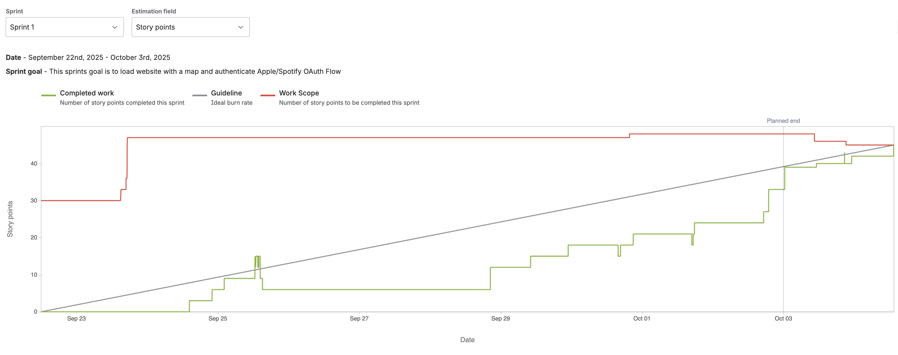

# Melody Map

## 📌 Project Name
**Melody Map**

---

## 🎯 Description

**Who you’re working with**  
Team Members:  
- Mateo Salinas  
- Leon Altamirano  
- Devin Schupbach  
- Caden Sprague  
- Jacob Mora  

**What you’re creating**  
We are building a website where people around you can see what music you are listening to in real time. Beyond simply showing the current track, we aim to add unique features such as displaying which portion of a song someone is on. The website will integrate with both **Spotify** and **Apple Music**, and depending on how our sprints progress, we may also expand to a mobile app version.  

**Who you’re doing it for (your audience)**  
Our audience includes students, music enthusiasts, and everyday listeners who want to share and discover music with people nearby.  

**Why you’re doing this (the impact/change you hope to make)**  
We want to:  
- Help people discover new music.  
- Provide a platform to share music in a fun, interactive way.  
- Encourage social connection through music discovery while maintaining user privacy.  

---

## 

 

---

## 🛠️ Technologies

We plan to use the following technologies:  
- **Frontend Engine** for loading the website  
- **Mapping Engine** for map/pins functionality  
- [Spotify API](https://developer.spotify.com/) and [Apple Music API](https://developer.apple.com/apple-music/) for track integration  
- **AI Tools**: [ChatGPT](https://chat.openai.com/), [Gemini](https://deepmind.google/technologies/gemini/), and [GitHub Copilot](https://github.com/features/copilot) to assist with debugging, formatting, and ideation.  

---

## 🚀 Features

### Initial Sprint Features

1. **Map Creation**  
   - Displays a world map on the site.  
   - Used by all users as the base interactive layer.  

2. **User Location Tracking**  
   - Automatically detects the user’s location when the app loads.  
   - Centers the map view on the user’s current location.  

3. **Pin Creation**  
   - Users can place “pins” on the map at specific locations.  
   - Optional feature: customize pin images (not required for MVP).  

4. **Music Integration – Apple Music**  
   - Pulls the current track name from Apple Music.  
   - Displays this info on the user’s pin/location.  

5. **Music Integration – Spotify**  
   - Pulls the current track name from Spotify.  
   - Displays this info on the user’s pin/location.  

6. **Nearby Listening Visibility**  
   - Allows users to see what others within a one-mile radius are listening to in real time.  
##
# Sprint 1 Review

### Review and Retrospective

For this sprint our main focus was to create the website, communicate with spotify api, and create a map.

* [__Retrospective__](./Documentation/Sprint1-Retrospective.md)

* __Burnup Report:__ 

* __Contributions__

   * __Caden__ : Established a route that communicates with Spotify API, and implemented spotify token refresh (so end user needs to manually verify as little as possible).
      * [Jira Task Documentation](./Documentation/Sprint1-Jira.md)
   * __Devin__ : Created and designed the inital homepage/website, implemented a feature to display the current song's  metadata on map pin, and display which account type has been linked.
      * [Jira Task Documentation](./Documentation/Sprint1-Jira.md)
   * __Jacob__ : Created a barebones flask website to run locally, implemented a feature that shows error codes coming from spotify's api, and researched on how to deploy to firebase. 
      * [Jira Task Documentation](./Documentation/Sprint1-Jira.md)
   * __Leon__ : I implemented the OAuth login and handled the OAuth callback process. I also worked with Caden to store the access token securely. In addition, I developed the OAuth request and redirect endpoints and integrated the login display into the home.html page.
      * [Jira Task Documentation](./Documentation/Sprint1-Jira.md)
   * __Mateo__ : Researched and implemented the map API. Ensured map displayed current user location, can scroll, and zoom in and out of map. Also made sure user can add pins to map and the pin(s) are displayed. 

* __Future Implementation__

   * Deploy to firebase

   * Create better UI/UX

   * Show other users' songs on map

   * Refine pin functionality

# Sprint 2 Review

### Review and Retrospective

For this sprint our main focus was to create the website, communicate with spotify api, and create a map.

* [__Retrospective__](LINK GOES HERE)

* __Burnup Report:__ 

* __Contributions__

   * __Caden__ : 
      * [Jira Task Documentation](./Documentation/Sprint2-Jira.md)
   * __Devin__ : I merged all the different webpages we had into one homepage, fixed the visuals for the pin song information that was displayed, and redesigned the UI for the homepage for a polished look.
      * [Jira Task Documentation](ADD LINK)
   * __Jacob__ : 
      * [Jira Task Documentation](ADD LINK)
   * __Leon__ : 
      * [Jira Task Documentation](ADD LINK)
   * __Mateo__ :  

* __Future Implementation__

   * 

   * 

   * 

   * 

